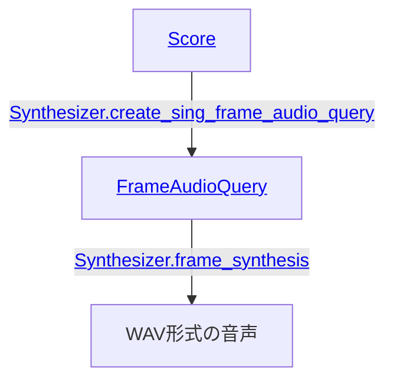
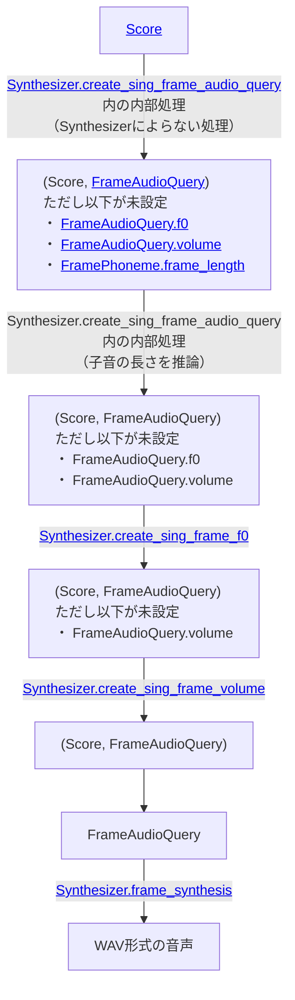

# 歌唱音声合成

[VOICEVOX コア ユーザーガイド]と同じ手順で環境構築ができているものとします。

歌唱音声合成を行うためにはまず[`Score`]（楽譜）を用意します。

```py
from voicevox_core import Note, Score

score = Score(
    [
        Note(15, ""),
        Note(45, "ド", key=60),
        Note(45, "レ", key=62),
        Note(45, "ミ", key=64),
        Note(15, ""),
    ],
)
```

Rust API, C API, Java APIでは`Score`は以下のようなJSONで表現できます。

```json
{
  "notes": [
    { "key": null, "frame_length": 15, "lyric": "" },
    { "key": 60, "frame_length": 45, "lyric": "ド" },
    { "key": 62, "frame_length": 45, "lyric": "レ" },
    { "key": 64, "frame_length": 45, "lyric": "ミ" },
    { "key": null, "frame_length": 15, "lyric": "" }
  ]
}
```

`Score`中の[`Note`]には音符と休符があります。[`Score.notes`]の最初のノートは休符にします。

`Note`の`lyric`と`key`に次の値を設定します。

- 音符の場合:
    - `Note.lyric`: 一つのモーラを表すひらがな/カタカナで歌詞を設定（例: `"ド"`, `"ファ"`）。
    - `Note.key`: MIDIのnote numberで音階を設定（例: C4なら`60`）。
- 休符の場合:
    - [`Note.lyric`]\: 空文字列を設定。
    - [`Note.key`]\: `null`/`None`を設定。

[`Note.frame_length`]には、秒数に93.75をかけて端数を調整したものを設定します。
（例: 125BPM (_**B**eats **P**er **M**inute_)における一拍は、93.75\[フレーム/秒\] / (125\[拍/分\] / 60\[秒/分\]) = `45`\[フレーム/拍\]）。

[`Synthesizer.create_sing_frame_audio_query`]で`Score`から[`FrameAudioQuery`]を生成します。
指定できる`style_id`は、[種類]が`"singing_teacher"`か`"sing"`であるスタイルの`id`です。

```py
SINGING_TEACHER = 6000  # 波音リツ（ノーマル）
frame_audio_query = synthesizer.create_sing_frame_audio_query(
    score, SINGING_TEACHER
)
```

## 子音の侵食

`Score.notes`から`FrameAudioQuery.phonemes`を生成する際、`Note.lyric`は子音と母音に分割されます。このときの母音の開始位置は、ノートの開始位置と同じになるように調整されます。子音は母音より前に位置するため、子音は一つ前のノートを侵食します。

例えば冒頭の`Score`の例からは次のようにフレームが分割されます。

```json
{
  "phonemes": [
    { "phoneme": "pau", "frame_length": 13 },
    { "phoneme": "d", "frame_length": 2 },
    { "phoneme": "o", "frame_length": 39 },
    { "phoneme": "r", "frame_length": 6 },
    { "phoneme": "e", "frame_length": 40 },
    { "phoneme": "m", "frame_length": 5 },
    { "phoneme": "i", "frame_length": 45 },
    { "phoneme": "pau", "frame_length": 15 },
  ],
  …
}
```

図示するとこうなります。

```
    15                    45                             45                             45                   15
+----------+------------------------------+------------------------------+------------------------------+----------+
|          |              do              |              re              |              mi              |          | ノート列
+----------+------------------------------+------------------------------+------------------------------+----------+
.          .                              .                              .                              .          .
.          .                              .                              .                              .          .
.          .                              .                              .                              .          .
+--------+-+-------------------------+----+--------------------------+---+------------------------------+----------+
|        |d|            o            | r  |            e             | m |              i               |          | 音素列
+--------+-+-------------------------+----+--------------------------+---+------------------------------+----------+
    13    2             39             6               40              5                45                   15
```

## ノートID

`FrameAudioQuery`を生成するとき、[`Note.id`]の文字列が[`FramePhoneme.note_id`]にコピーされます。歌唱音声には影響しません。

```json
{
  "notes": [
    { "lyric": "", "id": "①", … },
    { "lyric": "ド", "id": "②", … },
    { "lyric": "レ", "id": "③", … },
    { "lyric": "ミ", "id": "④", … },
    { "lyric": "", "id": "⑤", … }
  ]
}
```

↓

```json
{
  "phonemes": [
    { "phoneme": "pau", "note_id": "①", … },
    { "phoneme": "d", "note_id": "②", … },
    { "phoneme": "o", "note_id": "②", … },
    { "phoneme": "r", "note_id": "③", … },
    { "phoneme": "e", "note_id": "③", … },
    { "phoneme": "m", "note_id": "④", … },
    { "phoneme": "i", "note_id": "④", … },
    { "phoneme": "pau", "note_id": "⑤", … },
  ],
  …
}
```

## 歌唱音声合成の流れ

歌唱音声合成の流れを図にするとこのようになります。



詳細な流れは次になります。



[VOICEVOX コア ユーザーガイド]: ./usage.md
[`Score`]: https://voicevox.github.io/voicevox_core/apis/python_api/autoapi/voicevox_core/index.html#voicevox_core.Score
[`Score.notes`]: https://voicevox.github.io/voicevox_core/apis/python_api/autoapi/voicevox_core/index.html#voicevox_core.Score.notes
[`Note`]: https://voicevox.github.io/voicevox_core/apis/python_api/autoapi/voicevox_core/index.html#voicevox_core.Note
[`Note.frame_length`]: https://voicevox.github.io/voicevox_core/apis/python_api/autoapi/voicevox_core/index.html#voicevox_core.Note.frame_length
[`Note.lyric`]: https://voicevox.github.io/voicevox_core/apis/python_api/autoapi/voicevox_core/index.html#voicevox_core.Note.lyric
[`Note.key`]: https://voicevox.github.io/voicevox_core/apis/python_api/autoapi/voicevox_core/index.html#voicevox_core.Note.key
[`Note.id`]: https://voicevox.github.io/voicevox_core/apis/python_api/autoapi/voicevox_core/index.html#voicevox_core.Note.id
[`FrameAudioQuery`]: https://voicevox.github.io/voicevox_core/apis/python_api/autoapi/voicevox_core/index.html#voicevox_core.FrameAudioQuery
[`FramePhoneme.note_id`]: https://voicevox.github.io/voicevox_core/apis/python_api/autoapi/voicevox_core/index.html#voicevox_core.FramePhoneme.note_id
[種類]: https://voicevox.github.io/voicevox_core/apis/python_api/autoapi/voicevox_core/index.html#voicevox_core.StyleType
[`Synthesizer.create_sing_frame_audio_query`]: https://voicevox.github.io/voicevox_core/apis/python_api/autoapi/voicevox_core/blocking/index.html#voicevox_core.blocking.Synthesizer.create_sing_frame_audio_query
[`Synthesizer.frame_synthesis`]: https://voicevox.github.io/voicevox_core/apis/python_api/autoapi/voicevox_core/blocking/index.html#voicevox_core.blocking.Synthesizer.frame_synthesis
