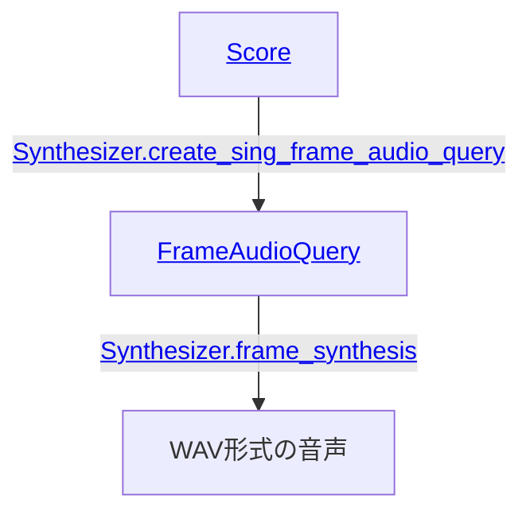
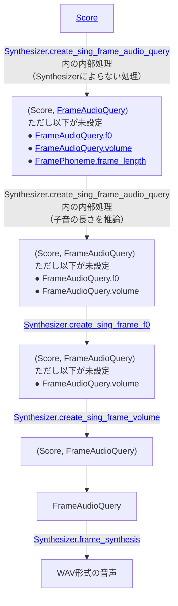

# 歌唱音声合成

[VOICEVOX コア ユーザーガイド]と同じ手順にて環境構築はできているものとします。

歌唱音声合成を行うためにはまず[`Score`]（楽譜）を用意します。

```py
from voicevox_core import Note, Score

score = Score(
    [
        Note(15, ""),
        Note(45, "ド", key=60),
        Note(45, "レ", key=62),
        Note(45, "ミ", key=64),
        Note(15, ""),
    ],
)
```

Rust API, C API, Java APIでは`Score`は以下のようなJSONで表現できます。

```json
{
  "notes": [
    { "key": null, "frame_length": 15, "lyric": "" },
    { "key": 60, "frame_length": 45, "lyric": "ド" },
    { "key": 62, "frame_length": 45, "lyric": "レ" },
    { "key": 64, "frame_length": 45, "lyric": "ミ" },
    { "key": null, "frame_length": 15, "lyric": "" }
  ]
}
```

`Score`中の[`Note`]には無音のノートと無音でないノートがあります。
[`Score.notes`]の最初のノートは無音にします。

`Note`には次の値を設定します。

- [`Note.frame_length`]: 秒数に93.75をかけ、端数を調整したものを設定（例: 125BPMにおける一拍として、(125 / 60)⁻¹ × 93.75 = `45`）。
- 無音のノートの場合:
    - [`Note.lyric`]\: 空文字列を指定。
    - [`Note.key`]\: `null`/`None`を設定。
- 無音ではないノートの場合:
    - `Note.lyric`: 一つのモーラを表すひらがな/カタカナで歌詞を設定（例: `"ド"`, `"ファ"`）。
    - `Note.key`: MIDIのnote numberで音階を指定（例: C4として`60`）。

[`Synthesizer.create_sing_frame_audio_query`]で`Score`から[`FrameAudioQuery`]を生成し、[`Synthesizer.frame_synthesis`]で音声合成してWAVデータを生成します。

```py
SINGING_TEACHER = 6000  # 波音リツ（ノーマル）
SINGER = 3000  # 四国めたん（あまあま）

frame_audio_query = synthesizer.create_sing_frame_audio_query(
    score, SINGING_TEACHER
)
wav = synthesizer.frame_synthesis(frame_audio_query, SINGER)
```

## `frame_length`

情報がモーラ単位である`Score.notes`から、情報が音素単位である`FrameAudioQuery.phonemes`を生成する際、`Note.frame_length`も子音と母音で適切に分割されることになります。このとき単にノート一つ一つが二つに分割されるのではなく、子音が一つ前のノートの末尾に位置するようになります。

`Score`の先頭が無音であることを要求されるのはこのためです。

例えば冒頭の`Score`の例からは次のようにフレームが分割されます。

```json
{
  "phonemes": [
    { "phoneme": "pau", "frame_length": 13 },
    { "phoneme": "d", "frame_length": 2 },
    { "phoneme": "o", "frame_length": 39 },
    { "phoneme": "r", "frame_length": 6 },
    { "phoneme": "e", "frame_length": 40 },
    { "phoneme": "m", "frame_length": 5 },
    { "phoneme": "i", "frame_length": 45 },
    { "phoneme": "pau", "frame_length": 15 },
  ],
  …
}
```

図示するとこのようになります。GitHubのフォントの関係上、「ド」,「レ」,「ミ」を"do", "re", "mi"と書き、無音ノートと無音音素を"pau"と書きます。

```
    15                    45                             45                             45                   15
+----------+------------------------------+------------------------------+------------------------------+----------+
|   pau    |              do              |              re              |              mi              |   pau    |
+----------+------------------------------+------------------------------+------------------------------+----------+
.          .                              .                              .                              .          .
.          .                              .                              .                              .          .
.          .                              .                              .                              .          .
+--------+-+-------------------------+----+--------------------------+---+------------------------------+----------+
|  pau   |d|            o            | r  |            e             | m |              i               |   pau    |
+--------+-+-------------------------+----+--------------------------+---+------------------------------+----------+
    13    2             39             6               40              5                45                   15
```

## 歌唱音声合成の流れ

歌唱音声合成の流れを図にするとこのようになります。



詳細な流れは次になります。



[VOICEVOX コア ユーザーガイド]: ./usage.md
[`Score`]: https://voicevox.github.io/voicevox_core/apis/python_api/autoapi/voicevox_core/index.html#voicevox_core.Score
[`Score.notes`]: https://voicevox.github.io/voicevox_core/apis/python_api/autoapi/voicevox_core/index.html#voicevox_core.Score.notes
[`Note`]: https://voicevox.github.io/voicevox_core/apis/python_api/autoapi/voicevox_core/index.html#voicevox_core.Note
[`Note.frame_length`]: https://voicevox.github.io/voicevox_core/apis/python_api/autoapi/voicevox_core/index.html#voicevox_core.Note.frame_length
[`Note.lyric`]: https://voicevox.github.io/voicevox_core/apis/python_api/autoapi/voicevox_core/index.html#voicevox_core.Note.lyric
[`Note.key`]: https://voicevox.github.io/voicevox_core/apis/python_api/autoapi/voicevox_core/index.html#voicevox_core.Note.key
[`FrameAudioQuery`]: https://voicevox.github.io/voicevox_core/apis/python_api/autoapi/voicevox_core/index.html#voicevox_core.FrameAudioQuery
[`Synthesizer.create_sing_frame_audio_query`]: https://voicevox.github.io/voicevox_core/apis/python_api/autoapi/voicevox_core/blocking/index.html#voicevox_core.blocking.Synthesizer.create_sing_frame_audio_query
[`Synthesizer.frame_synthesis`]: https://voicevox.github.io/voicevox_core/apis/python_api/autoapi/voicevox_core/blocking/index.html#voicevox_core.blocking.Synthesizer.frame_synthesis
