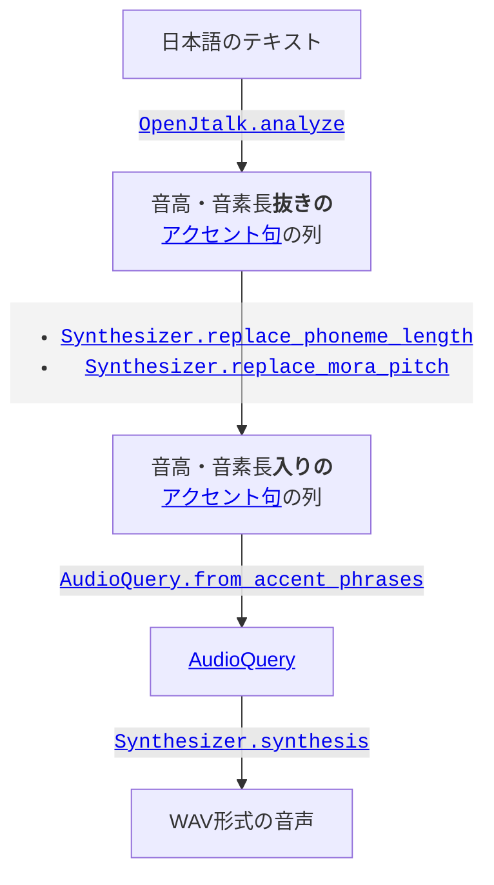
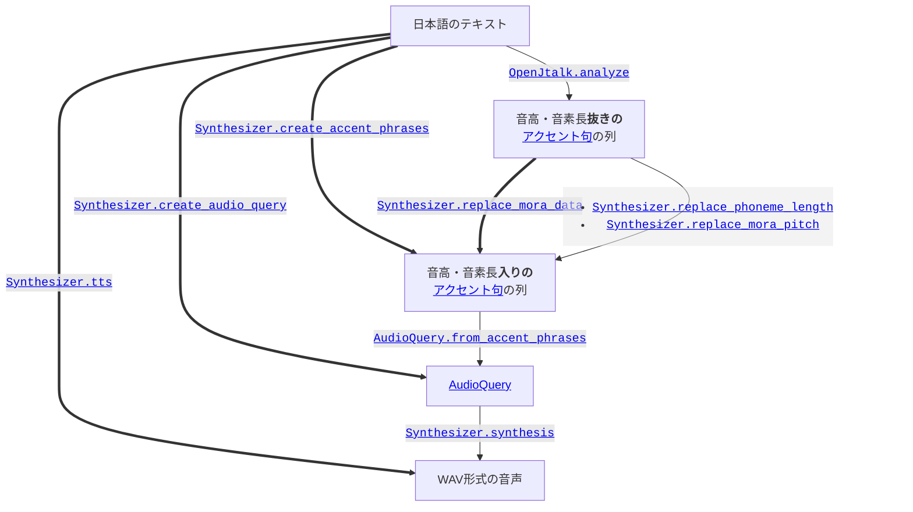

# テキスト音声合成の流れ

テキスト音声合成の流れを図にするとこのようになります。

毎回これらの関数を経るのは大変なので、ショートハンドとなるAPIもあります。例えば[`Synthesizer.tts`]は日本語のテキストから直接音声を生成します。

[`Synthesizer.tts`]: https://voicevox.github.io/voicevox_core/apis/python_api/autoapi/voicevox_core/blocking/index.html#voicevox_core.blocking.Synthesizer.tts

